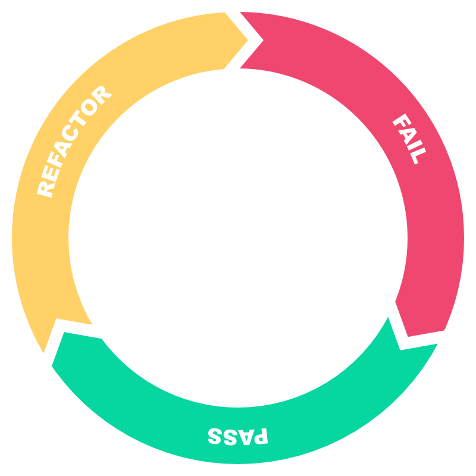

<!-- _backgroundColor: #222222 -->
<!-- _paginate: false -->
<!-- _footer: June 2022 -->

# Test Driven Development (TDD)

An Introduction by Kevin Denver

---

## Red-Green-Refactor: The Building Blocks of TDD

Test-driven development follows a three-phase process:

* **Red**. We write a failing test (including possible compilation failures). We run the test suite to verify the failing tests.

* **Green**. We write just enough production code to make the test green. We run the test suite to verify this.

* **Refactor**. We remove any code smells. These may be due to duplication, hardcoded values, or improper use of language idioms. If we break any tests during refactoring, we prioritize getting them back to green before exiting this phase.

---

## References
<!-- _class: small-font -->

* [Learning Test-Driven Development][1]
* [Mocks Aren't Stubs][2]
* [Scientific Research Into Pair Programming][3]
* [The Art of Agile Development, 2nd Edition][4]
* [Detroit and London Schools of Test-Driven Development][5]

[1]: https://learning.oreilly.com/library/view/learning-test-driven-development/9781098106461/
[2]: https://martinfowler.com/articles/mocksArentStubs.html
[3]: https://tuple.app/pair-programming-guide/scientific-research-into-pair-programming
[4]: https://learning.oreilly.com/library/view/the-art-of/9781492080688/
[5]: https://blog.devgenius.io/detroit-and-london-schools-of-test-driven-development-3d2f8dca71e5
