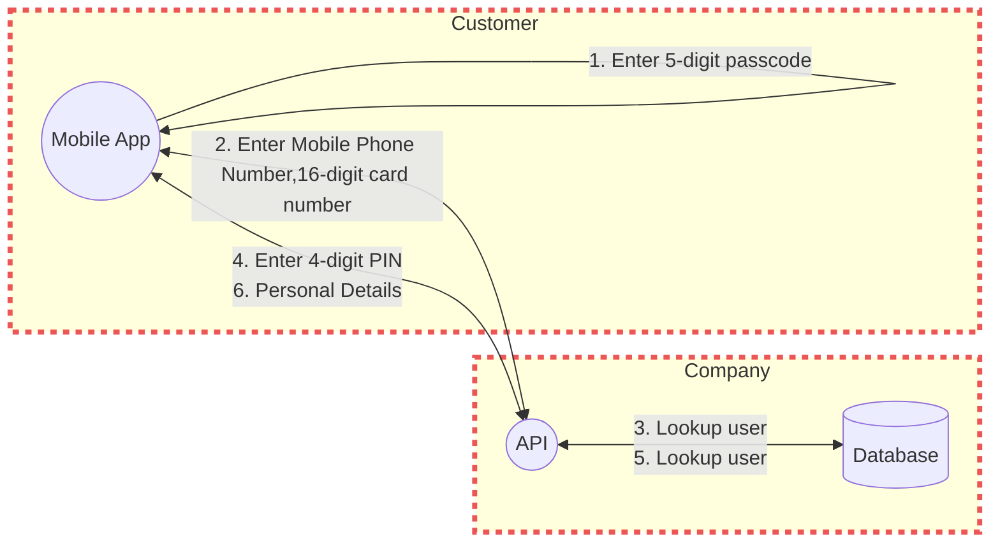
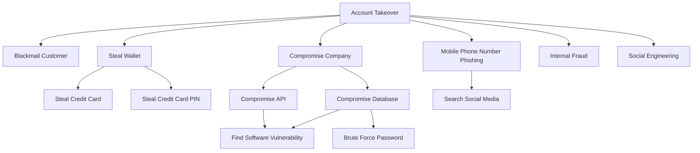

# Mobile Registration

## Data Flows

Name|From|To |Data|Protocol|Port
|:----|:----|:---|:----|:--------|:----|
|1. Enter 5-digit passcode|Mobile App|Mobile App|Personal Passcode|N/A|N/A|
|2. Enter Mobile Phone Number, 16 digit card number|Mobile App|API|Mobile Phone Number PAN|HTTPS|443|
|3. Lookup user|Api|Database|Personal Details|SQL|443|
|4. Enter 4-digit PIN|Mobile App|API|PIN|HTTP2|443|
|5. Personal Details|Api|Mobile App|Personal Details|HTTPS|443|

## Data Dictionary

Name|Description|Classification|Carried|Processed
|:----|:--------|:----|:----|:----|
|Personal Passcode|A 5-digit personal passcode|SENSITIVE|1. Enter 5-digit passcode|Mobile App|
|Personal Details|Firstname, Lastname, D.O.B, Address|RESTRICTED|5. Personal Details|Mobile App API Database|
|Mobile Phone Number|The customer's phone number|PUBLIC|2. Enter Mobile Phone Number, 16 digit card number|Mobile App API|
|PAN|The 16-digit card number|SENSITIVE|2. Enter Mobile Phone Number, 16 digit card number|Mobile App API|
|PIN|The 4-digit card PIN|SENSITIVE|4. Enter 4-digit PIN|Mobile App API|

## Assumptions

1. The network traffic between the mobile app and the API is encrypted using [TLS](https://en.wikipedia.org/wiki/Transport_Layer_Security).

1. The mobile app is using [Certificate Pinning](https://d3fend.mitre.org/technique/d3f:CertificatePinning) to allow
for greater client confidence in the remote server's identity for SSL connections.

## Threats & Mitigations

### API

#### Exploit Public-Facing Application

Adversaries may attempt to take advantage of a weakness in an Internet-facing computer or
program using software, data, or commands in order to cause unintended or unanticipated behaviour.

Reference: [T1190: Exploit Public-Facing Application](https://attack.mitre.org/techniques/T1190/)

Mitigation: [M1048: Application Isolation and Sandboxing](https://attack.mitre.org/mitigations/M1048/)

### 2. Enter Mobile Phone Number, 16-digit card number

#### Brute Force

Adversaries may use brute force techniques to gain access to accounts when passwords are unknown or when password hashes are obtained.

Reference: [T1110: Brute Force](https://attack.mitre.org/techniques/T1110/)

Mitigation: [M1036: Account Use Policies](https://attack.mitre.org/mitigations/M1036/)

#### Man in the Middle

Adversaries with privileged network access may seek to modify network traffic in real time using man-in-the-middle (MITM) attacks.

Reference: [T0830: Man in the Middle](https://attack.mitre.org/techniques/T0830/)

Mitigation: [Software Process and Device Authentication](https://attack.mitre.org/mitigations/M0813/)

### 3. Lookup User

#### Exploitation for Credential Access

Adversaries may exploit software vulnerabilities in an attempt to collect credentials.

Reference: [T1212: Exploitation for Credential Access](https://attack.mitre.org/techniques/T1212/)

Mitigation: [M1048: Application Isolation and Sandboxing](https://attack.mitre.org/mitigations/M1048/)

#### Data Manipulation

Adversaries may insert, delete, or manipulate data in order to influence external outcomes or hide activity, thus threatening the integrity of the data.

Reference: [T1565: Data Manipulation](https://attack.mitre.org/techniques/T1565/)

Mitigation: [M1041: Encrypt Sensitive Information](https://attack.mitre.org/mitigations/M1041/)

### 4. Enter 4-digit PIN

#### Brute Force

Adversaries may use brute force techniques to gain access to accounts when passwords are unknown or when password hashes are obtained.

Reference: [T1110: Brute Force](https://attack.mitre.org/techniques/T1110/)

Mitigation: [M1036: Account Use Policies](https://attack.mitre.org/mitigations/M1036/)

#### Man in the Middle

Adversaries with privileged network access may seek to modify network traffic in real time using man-in-the-middle (MITM) attacks.

Reference: [T0830: Man in the Middle](https://attack.mitre.org/techniques/T0830/)

Mitigation: [Software Process and Device Authentication](https://attack.mitre.org/mitigations/M0813/)

Mitigation: [Secure Remote Password Protocol](https://en.wikipedia.org/wiki/Secure_Remote_Password_protocol)

## Attack Tree

### Account Takeover

## References

* [Threat Modeling Cheat Sheet](https://cheatsheetseries.owasp.org/cheatsheets/Threat_Modeling_Cheat_Sheet.html)
* [STRIDE](https://en.wikipedia.org/wiki/STRIDE_(security))
* [MITRE Attack](https://attack.mitre.org/)
* [MITRE Defend](https://d3fend.mitre.org/)
* [MITRE GitHub](https://github.com/mitre/cti)
* [MITRE CWE](https://cwe.mitre.org/index.html)
