# Threat Modelling

An Introduction by Kevin Denver

---

---

## What if?

Wouldn’t it be better to find security issues before you write a line of code?

---

## Ways to find Security Issues

* Static Analysis
* Fuzzing
* Penetration Test
* Vulnerability Disclosures
* Bug Bounty Programe

---

## ..and Threat Modelling

* Think about security issues **early**!
* Understand your requirements better
* Prevent bugs before writing a single line of code

> Shift Left is a practice intended to find and prevent defects early in the software delivery process. [devopedia: Shift Left][10]
---

## What is Threat Modelling?

Threat modelling works to **identify**, **communicate** and **understand threats and mitigations** within the context of protecting something of **value**.

A threat model is a **structured representation** of all the information that affects the security of an application. In essence, it is a view of the application and its environment through the **lens of security**.

---

## What does a Threat Model consist of?

A threat model typically includes:

* Description of the subject to be modelled
* Assumptions that can be checked or challenged in the future as the threat landscape changes
* Potential threats to the system
* Actions that can be taken to mitigate each threat
* A way of validating the model and threats, and verification of success of actions taken

---

## When do you do a Threat Model?

Threat modelling is best applied **continuously** throughout a software development project!

Updating threat models is advisable after events such as:

* A new feature is released
* Security incident occurs
* Architectural or infrastructure changes

---

---

## References
<!-- _footer: https://github.com/ToastShaman/ -->

* [Lecture on Threat Modeling with STRIDE][1]
* [OWASP Threat Modelling][2]
* [Threat Modelling Cheat Sheet][3]
* [Threat Modelling Cookbook][4]
* [pytm: A Pythonic framework for threat modeling][5]
* [mermaid: Mermaid lets you create diagrams and visualisations using text and code][6]
* [MITRE ATT&CK: A knowledge base of adversary tactics and techniques][7]
* [MITRE D3FEND: A knowledge graph of cybersecurity countermeasures][8]
* [The STRIDE Threat Model][9]

[1]: https://users.encs.concordia.ca/~clark/courses/1601-6150/scribe/L04c.pdf
[2]: https://owasp.org/www-community/Threat_Modeling
[3]: https://cheatsheetseries.owasp.org/cheatsheets/Threat_Modeling_Cheat_Sheet.html
[4]: https://owasp.org/www-project-threat-model-cookbook/
[5]: https://github.com/izar/pytm
[6]: https://mermaid-js.github.io/mermaid/#/
[7]: https://attack.mitre.org/
[8]: https://d3fend.mitre.org/
[9]: https://docs.microsoft.com/en-us/previous-versions/commerce-server/ee823878(v=cs.20)?redirectedfrom=MSDN
[10]: https://devopedia.org/shift-left