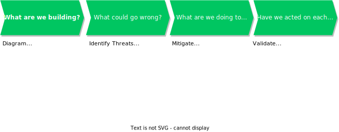

<!-- _backgroundColor: #222222 -->
<!-- _paginate: false -->
<!-- _footer: June 2022 -->

<style scoped>
  h1 { color: #F5F5F5; }
  p { color: #DCDCDC; }
</style>


# Threat Modelling

An Introduction by Kevin Denver

---


> [XKCD: 538](https://xkcd.com/538/)

---

<!-- _backgroundColor: #ee5166 -->
<!-- _backgroundImage: "linear-gradient(315deg, #ee5166 10%, #E3056C 85%)" -->
<!-- _class: interval-slide -->


Software Development Lifecycle (SDLC)

---


> Agile Software Development Life Cycle (SDLC)
> https://mlsdev.com/blog/agile-sdlc

---


* Integrating the Agile methodology into the software development lifecycle (SDLC) splits development into **iterative phases** with **continuous user feedback**.
* Agile SDLC usually focus on **rapid iteration**, meaning deliverables are smaller and more frequent. This has a number of advantages including:
  * The cost of change is small
  * SDLC phases can occur in parallel
  * More frequent deliverables

> https://www.atlassian.com/agile
> https://snyk.io/learn/secure-sdlc/agile-sdlc/
> https://snyk.io/learn/sdlc-software-development-life-cycle/

---


> Secure Software Development Life Cycle (SSDLC)
> https://snyk.io/learn/secure-sdlc/

---
<!-- _class: small-font -->


* **Phase 1: Requirements**
  * Requirements for new features are collected from various stakeholders
  * Identify any security considerations
* **Phase 2: Design**
  * Functional requirements typically describe what should happen, while security requirements usually focus on what shouldn't.
* **Phase 3: Development**
  * Concerns usually shift to making sure the code is well-written from a security perspective.
  * Follow secure coding guidelines as well as code reviews
* **Phase 4: Verification**
  * Automated tests that express the critical paths of your application
  * Automated execution of application unit tests that verify the correctness of the underlying application
* **Phase 5: Maintenance and Evolution**
  * Vulnerabilities that slipped through the cracks may be found in the application long after it’s been released. 
  * These vulnerabilities may be in the code developers wrote, but are increasingly found in the underlying open-source components that comprise an application.
  * These vulnerabilities then need to be patched by the development team.

> https://snyk.io/learn/secure-sdlc/

---
<!-- _class: small-font -->


* **Shift mindset towards DevSecOps**
  * One of the most impactful strategies is implementing software security from the start.
* **Keep Security Requirements Current**
  * Giving the development team a clear picture of security requirements as the threat landscape evolves is a **continuous process**. Security risk documentation should be updated when new threats arise to ensure the software is protected against new threats, which are often more complex or creative than previous threats.
* **Take advantage of Threat Modelling**
  * Threat modelling is a vital process that delivers both speed and security. It predicts potential locations, severity, and risk of security vulnerabilities and proactively addresses security before they become a problem. This SDLC best practice lets developers consider security threats earlier in the development process, where they can more easily modify the source code to mitigate vulnerabilities.
* **Establish Secure Design Requirements**
  * Standardization is one of the most impactful secure SDLC best practices. It creates a predictable roadmap to develop code and it facilitates continuous improvement when integrating security.
* **Use Open Source Components...Securely**
  * Open source components are a great way to increase speed in software development. But because you don’t directly manage the security of this open source code, it is best to implement software composition analysis (SCA) tools and use an open source code analyzer.

> https://snyk.io/learn/secure-sdlc/best-practices/
> Shift Left is a practice intended to find and prevent defects early in the software delivery process. [devopedia: Shift Left][10]

---
<!-- _class: small-font -->


* **Perform Penetration Testing**
  * While a code review looks at the code for potential vulnerabilities, a SDLC best practice that extends that analysis is penetration testing. This assessment process employs a security expert to try to attack the application to identify vulnerable locations or security risks.
* **Manage Potential Vulnerabilities**
  * New vulnerabilities can be disclosed at any time, highlighting the importance of continuously monitoring your projects throughout the SDLC, even after they have been deployed.
* **Prepare a standard Incident Response**
  * Security issues will happen despite all the proactive efforts, tools, and processes you use. Therefore, it’s essential to have a dedicated task force with established roles and responsibilities to absorb the news of a security breach, define a mitigation plan, and execute it as urgently as possible. Conducting mock emergencies and trialing the procedure helps prepare your team for the real thing.
* **Setting up a Security Champions Program**
  * Security champions initiatives help security and development teams work together. Both of these teams aspire to create secure applications as quickly as possible, but security policies have traditionally been added to the SDLC without scaling the knowledge and processes via development teams. This results in automatic or manual security gates, which could lead to developer rework, dissatisfaction, and a slower total product delivery. Security champions can help bring security to the conversation earlier for a more effective SSDLC.

> https://snyk.io/learn/secure-sdlc/best-practices/

---
<!-- _backgroundColor: #ee5166 -->
<!-- _backgroundImage: "linear-gradient(315deg, #ee5166 10%, #E3056C 85%)" -->
<!-- _class: interval-slide -->


Threat Modelling

---

## What is Threat Modelling?

* Threat modelling works to **identify**, **communicate** and **understand threats and mitigations** within the context of protecting something of **value**.

* A threat model is a **structured representation** of all the information that affects the security of an application.

* In essence, it is a view of the application and its environment through the **lens of security**.

* A threat model typically includes:
  * Description of the subject to be modelled
  * Assumptions that can be checked or challenged in the future as the threat landscape changes
  * Potential threats to the system
  * Actions that can be taken to mitigate each threat
  * A way of validating the model and threats, and verification of success of actions taken

* Threat modelling is best applied **continuously** throughout a software development lifecycle

---



---

## What are we building?

* Use **Data Flow Diagrams (DFD)** to describe the system or feature you are building
  * Use tools such as [Mermaid][6] or [pytm][5] rather than drawaing diagrams by hand!
    * Easy to refactor and easy to change
    * Can be automated and potentially generated from sources (?)

* Focus on **Assets**: valuable things the business cares about
  * Something an attacker wants
  * Something you want to protect
  * A stepping stone?

* Define **Trust Boundaries**
  * A **trust boundary** and an **attack surface** are very similar views of the same thing.
  * An attack surface is a trust boundary and a direction from which an attacker could launch an attack.
  * Generally, the idea is that within a boundary or zone, there is a common level of security. Within such a zone, the components trust each other and do not have to question each other's integrity.

> https://en.wikipedia.org/wiki/Data-flow_diagram

---


---
<!-- _class: small-font -->

```mermaid
flowchart LR
    subgraph Customer
    app((Mobile App))
    end

    subgraph Company
    api((Rest API))
    end

    subgraph AWS
    database[(Database)]
    end

    subgraph Twilio
    twilio[(Twilio)]
    end

    app -- 1. Enter Username and Password --> api
    api <-- 2. Lookup User\n3. User Details --> database
    api -- 4. Send OTP --> twilio
    twilio -. 5. Text OTP\nto Phone Number .-> app
    app <-- 6. Enter OTP\n7. Login Success --> api

    classDef bounds stroke:#ED5656,stroke-width:4px,stroke-dasharray: 5 5;
    class Customer,Company,AWS,Twilio bounds
```

> https://mermaid-js.github.io/mermaid/#/flowchart
---

## What can go wrong?

* Now that you have a diagram, you can really start looking for what can go wrong with its security.

* For instance, how do you know that the mobile app is used by the person you expect? What happens if someone modifies data in the database? Is it OK for information to move from one box to the next without being encrypted?

* Identifying threats can seem intimidating to a lot of people.

* You don’t need to come up with these questions by just staring at the diagram and scratching your chin.

* You can identify threats like these using the simple mnemonic **STRIDE**.
  * Structure helps get you to **completeness** and **predictability**
  * Need an engineering approach: Predictable, Reliable, Scalable
  * Can't be dependent on one brilliant person!

> See [Threat Modelling: 12 Available Methods][12]

---

## STRIDE

* **STRIDE** is a model for identifying computer security threats developed by Praerit Garg and Loren Kohnfelder at *Microsoft*.

* **STRIDE is a tool to guide you to threats, not to ask you to categorize what you’ve found!**

| Threat | Desired Property |
| :---  |:--- |
| **S**poofing | **Authenticity** |
| **T**ampering | **Integrity** |
| **R**epudiation | **Non-repudiability** |
| **I**nformation Disclosure | **Confidentiality** |
| **D**enial of service| **Availability** |
| **E**levation of privilege | **Authorization** |

> https://en.wikipedia.org/wiki/STRIDE_(security)

---
<!-- _backgroundColor: black -->


---
<!-- _class: smaller-font -->


* Assumptions
  * The mobile app is using certificate pinning to allow for greater client confidence in the remote server's identity.
  * All traffic is encrypted using TLS.

* 1 Enter Username and Password
  * **Threat**: Brute Forcing Username and Passwords (S). **Mitigation**: Lock account after N failed login attempts, Use two factor authentication (2FA)
  * **Threat**: SQL Injection (T). **Mitigation**: Validate user input, use parameterized SQL queries.

* 2 Lookup User
  * **Threat**: Leaking of customer email addresses and credit card details (I). **Mitigation**: Encrypt data at rest

* 5 Text OTP to Phone Number
  * **Threat**: Social Engineering where an attacker asks you to read out the OTP you just received (S). **Mitigation**: Do not send OTPs via Text but use apps such as Google Authenticator, Authy etc.
  * **Threat**: Malware/SIM Swapping Attack (S). **Mitigation**: Do not send OTPs via Text but use apps such as Google Authenticator, Authy etc.

* Rest API, Database, Twilio
  * **Threat**: Denial of Service Attack which prevents customers from login in. **Mitigation**: Liaise with service provider

---
<!-- _class: small-font -->

## Tips for Identifying Threats

* **Start with external entities:** If you're not sure where to start, start with the external entities or events which drive activity. There are many other valid approaches though: You might start with the web browser, look- ing for spoofing, then tampering, and so on. You could also start with the business logic if perhaps your lead developer for that component is in the room. Wherever you choose to begin, you want to aspire to some level of organization. You could also go in "STRIDE order" through the diagram. Without some organization, it's hard to tell when you’re done, but be careful not to add so much structure that you stifle creativity.

* **Never ignore a threat because it's not what you're looking for right now**. You might come up with some threats while looking at other categories. Write them down and come back to them. For example, you might have thought about "can anyone connect to our database," which is listed under information disclosure, while you were looking for spoofing threats. Redundancy in what you find can be tedious, but it helps you avoid missing things. If you find yourself asking whether "someone not authorized to connect to the database who reads information" constitutes spoofing or information disclosure, the answer is, who cares? Record the issue and move along to the next one.

* **Focus on feasible threats:** Along the way, you might come up with threats like "someone might insert a back door at the chip factory," or "someone might hire our janitorial staff to plug in a hardware key logger and steal all our passwords." These are real possibilities but not very likely compared to using an exploit to attack a vulnerability for which you haven't applied the patch, or tricking someone into installing software. There's also the question of what you can do about either.

> Shostack, A. (2014). Threat modeling : designing for security. Wiley.

---

## Attack Trees

* **Attack Trees** is an addition/alternative to STRIDE.

* Attack trees provide a formal, methodical way of describing the security of systems, based on varying attacks. Basically, you represent attacks against a system in a tree structure, with the goal as the root node and different ways of achieving that goal as leaf nodes.


> https://www.schneier.com/academic/archives/1999/12/attack_trees.html

---

## Attack Libraries

* Some practitioners have suggested that STRIDE is too high level, and should be replaced with a more detailed list of what can go wrong.
* https://attack.mitre.org/ - MITRE ATT&CK® is a globally-accessible knowledge base of adversary tactics and techniques based on real-world observations.
* https://d3fend.mitre.org/ - A knowledge graph of cybersecurity countermeasures.
* https://owasp.org/www-project-top-ten/ - The OWASP Top 10 is a standard awareness document for developers and web application security.

---
<!-- _class: small-font -->

## Threat-Specific Prioritisation Approaches

* For the threats/issues you decide to address, you have choices to make about how to approach those risks.
* It is perfectly reasonable to address risk via risk acceptance, either by business acceptance or user acceptance.
* Those choices include: wait and see, fix the easy stuff first, use threat ranking techniques or estimate the cost.
* DREAD was one of the first threat ranking techniques but DREAD is fairly subjective and leads to odd results in many circumstances. Therefore, as of 2010, DREAD is no longer recommended for use by the Microsoft SDL team.
* **Bug Bar**: In a bug bar, bugs are given a severity based on a shared understanding of their impact.

| Severity | Description |
| :---  |:--- |
| Critical | It is related to the most important issues, which could cause a catastrophic failure of the solution and critical damage to the involved counterparts. |
| High | It is related to important issues that may cause major disruption and thus should be seriously considered. |
| Medium | It is related to issues that should represent some concern and thus should not be overlooked. |
| Low | It is related to minor issues. |
| Info | It is related to mitigated issues or to topics that are included for completeness. |

> https://docs.microsoft.com/en-us/security/sdl/security-bug-bar-sample

---

## Validating That Threats Are Addressed

* You've been hard at work to address your threats, first by simply fixing them, and then by assessing risks around them. But are your efforts working? It is important that you test the fixes, and have confidence that anything previously identified has been addressed

  * Run automated unit, integration and E2E tests
  * Schedule an external penetration test
  * QA'in the Threat Model
    * The model actually matches reality closely enough.
    * Everything in the threat list is addressed and the threat model portion of the test plan is complete.
    * Threat model bugs are closed.

---

## pytm A Pythonic framework for threat modeling

*Traditional threat modeling too often comes late to the party, or sometimes not at all. In addition, creating manual data flows and reports can be extremely time-consuming. The goal of pytm is to shift threat modeling to the left, making threat modeling more automated and developer-centric.*

```python
tm = TM("my test tm")

User_Web = Boundary("User/Web")
Web_DB = Boundary("Web/DB")

user = Actor("User")
user.inBoundary = User_Web

web = Server("Web Server")
web.OS = "CloudOS"
web.isHardened = True
web.sourceCode = "server/web.cc"

user_to_web = Dataflow(user, web, "User enters comments (*)")
user_to_web.protocol = "HTTP"
user_to_web.dstPort = 80
user_to_web.data = Data('Comments in HTML or Markdown', classification=Classification.PUBLIC)
...
tm.process()
```

> https://github.com/izar/pytm
---

## OWASP Threat Dragon

*OWASP Threat Dragon is a modeling tool used to create threat model diagrams as part of a secure development lifecycle. Threat Dragon follows the values and principles of the threat modeling manifesto. It can be used to record possible threats and decide on their mitigations, as well as giving a visual indication of the threat model components and threat surfaces. Threat Dragon runs either as a web application or a desktop application.*


> https://owasp.org/www-project-threat-dragon/

---

## Threagile: Agile Threat Modeling

*Threagile is the open-source toolkit which allows to model an architecture with its assets in an agile declarative fashion as a YAML file directly inside the IDE or any YAML editor. Upon execution of the Threagile toolkit a set of risk-rules execute security checks against the architecture model and create a report with potential risks and mitigation advice. Also nice-looking data-flow diagrams are automatically created as well as other output formats (Excel and JSON). The risk tracking can also happen inside the Threagile YAML model file, so that the current state of risk mitigation is reported as well. Threagile can either be run via the command-line (also a Docker container is available) or started as a REST-Server.*

https://threagile.io/

---

## References
<!-- _class: small-font -->

* [Lecture on Threat Modelling with STRIDE][1]
* [OWASP Threat Modelling][2]
* [Threat Modelling Cheat Sheet][3]
* [Threat Modelling Cookbook][4]
* [pytm: A Pythonic framework for threat modelling][5]
* [mermaid: Mermaid lets you create diagrams and visualisations using text and code][6]
* [MITRE ATT&CK: A knowledge base of adversary tactics and techniques][7]
* [MITRE D3FEND: A knowledge graph of cybersecurity countermeasures][8]
* [The STRIDE Threat Model][9]
* [Threat Modelling: 12 Available Methods][12]
* [Secure by Design][13]
* [DREADful][14]
* [Software Security: Building Security In][15]
* [Security/OSSA-Metrics][16]
* [A Guide to Threat Modelling for Developers][17]
* [Threat Modelling at Microsoft][18]
* [Threat Modeling: Designing for Security][19]
* [Microsoft: SDL Security Bug Bar][20]
* [Threat Modeling Gamification for Fun and Profit – With Threat Dragon and EoP (Vlad Styran)][21]
* [Threat Modeling Manifesto][22]

[1]: https://users.encs.concordia.ca/~clark/courses/1601-6150/scribe/L04c.pdf
[2]: https://owasp.org/www-community/Threat_Modeling
[3]: https://cheatsheetseries.owasp.org/cheatsheets/Threat_Modeling_Cheat_Sheet.html
[4]: https://owasp.org/www-project-threat-model-cookbook/
[5]: https://github.com/izar/pytm
[6]: https://mermaid-js.github.io/mermaid/#/
[7]: https://attack.mitre.org/
[8]: https://d3fend.mitre.org/
[9]: https://docs.microsoft.com/en-us/previous-versions/commerce-server/ee823878(v=cs.20)?redirectedfrom=MSDN
[10]: https://devopedia.org/shift-left
[11]: https://www.schneier.com/academic/archives/1999/12/attack_trees.html
[12]: https://insights.sei.cmu.edu/blog/threat-modeling-12-available-methods/
[13]: https://learning.oreilly.com/library/view/secure-by-design/9781617294358/
[14]: https://docs.microsoft.com/en-us/archive/blogs/david_leblanc/dreadful
[15]: https://learning.oreilly.com/library/view/software-security-building/0321356705/
[16]: https://wiki.openstack.org/wiki/Security/OSSA-Metrics#DREAD
[17]: https://martinfowler.com/articles/agile-threat-modelling.html
[18]: https://www.microsoft.com/en-us/securityengineering/sdl/threatmodeling
[19]: https://www.amazon.co.uk/Threat-Modeling-Designing-Adam-Shostack/dp/1118809998
[20]: https://docs.microsoft.com/en-us/security/sdl/security-bug-bar-sample
[21]: https://www.youtube.com/watch?v=u2tmLrwv-nc
[22]: https://www.threatmodelingmanifesto.org/
